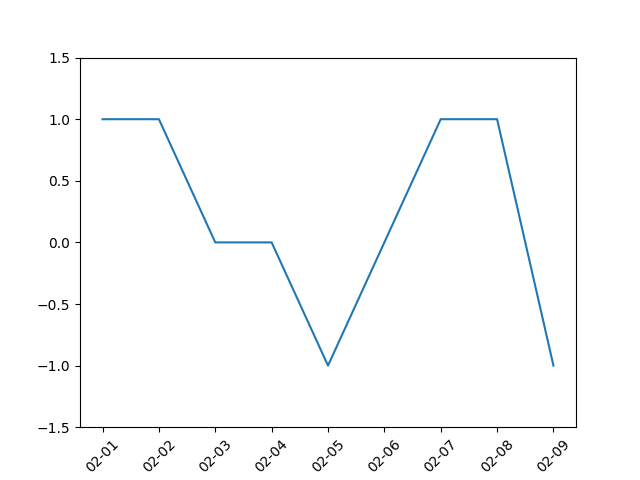

#Matplotlib
---------------------
<!-- TOC -->

- [Matplotlib](#matplotlib)
- [1.数据案例](#1数据案例)
- [2.修改绘图属性](#2修改绘图属性)
    - [2.1坐标](#21坐标)
            - [更改坐标范围](#更改坐标范围)
            - [设定坐标轴标签和旋转](#设定坐标轴标签和旋转)
    - [2.2添加文本](#22添加文本)
            - [添加标题](#添加标题)
            - [设置坐标轴标签](#设置坐标轴标签)
            - [增加图形背景gird](#增加图形背景gird)
            - [增加图例](#增加图例)
    - [2.3多种线条属性](#23多种线条属性)
            - [线条的类型](#线条的类型)
            - [图形的颜色](#图形的颜色)
            - [点的形状类型](#点的形状类型)
            - [设置线条宽度](#设置线条宽度)
- [3.常见图形绘制](#3常见图形绘制)
    - [3.1柱状图](#31柱状图)
    - [3.2直方图](#32直方图)
    - [3.3饼图](#33饼图)
    - [3.4箱线图](#34箱线图)
- [4.多图绘制](#4多图绘制)

<!-- /TOC -->

# 1.数据案例
我们以中国银行股票收盘价曲线作为例子来作为开场。
首先我们通过pandas导入数据，并提取出收盘价一列：
中国银行股票数据下载：
链接:http://pan.baidu.com/s/1gfxRFbH 密码:d3id

```
ChinaBank = pd.read_csv('data/ChinaBank.csv',index_col = 'Date')
ChinaBank = ChinaBank.iloc[:,1:]
#将时间格式转化为datetime格式
ChinaBank.index = pd.to_datetime(ChinaBank.index)
Close = ChinaBank.Close
```
绘制2014年中国银行股票收盘价的走势图：
```
plt.plot(Close['2014'])
plt.show()
```


# 2.修改绘图属性
## 2.1坐标
#### 更改坐标范围
```
plt.plot([1,1,0,0,-1,0,1,1,-1])
plt.show()
```

我们可以通过ylim方法修改y轴的范围，比如我们想修改为(-1.5,1.5),同理，我们可以通过xlim方法来修改x轴的坐标范围:
```
plt.plot([1,1,0,0,-1,0,1,1,-1])
plt.ylim(-1.5,1.5)
plt.show()
```

#### 设定坐标轴标签和旋转
我们可以通过xticks()和yticks()函数设定坐标的标签，两个函数主要有以下两个参数：
location:指坐标的位置.
labels：对应的坐标位置显示的标签.
两个参数一般是等长的数组,该函数另一个常用的参数是rotation参数，可以对坐标标签进行适当的旋转，看下面的例子：
```
plt.plot([1,1,0,0,-1,0,1,1,-1])
plt.ylim(-1.5,1.5)
plt.xticks(range(9),['02-01','02-02','02-03','02-04',
                     '02-05','02-06','02-07','02-08','02-09'],rotation=45)
plt.show()
```

X坐标由原来的数值1，2，3变成了我们设置的日期，同时标签与X轴成45度角.
## 2.2添加文本
#### 添加标题
添加标题可以通过title函数来实现，该函数主要有两个参数，第一个是str，指明标题的内容，第二个是loc，指明标题的位置，可以选择center，left或者right，默认是center
```
plt.plot(Close['2014'])
plt.title('中国银行2014年收盘价曲线',loc='right')
plt.show()
```

中文无法正常显示
```
#解决中文无法显示问题
from matplotlib.font_manager import FontManager, FontProperties
def getChineseFont():  
    #查找中文可以用字体
    return FontProperties(fname='/usr/share/fonts/truetype/wqy/wqy-microhei.ttc')  
plt.plot(Close['2014'])
plt.title('中国银行2014年收盘价曲线',loc='right',fontproperties=getChineseFont())
plt.show()
```

#### 设置坐标轴标签
```
plt.plot(Close['2014'])
plt.title('中国银行2014年收盘价曲线',loc='right',fontproperties=getChineseFont())
plt.xlabel('日期',fontproperties=getChineseFont())
plt.ylabel('收盘价',fontproperties=getChineseFont())
plt.show()
```

#### 增加图形背景gird
绘图时常常会在图形背景中增添方格，以便于人们更直观地读取线条中点的坐标取值以及线条整体的分布范围.可以使用grid函数增加和设定图形的背景.
函数原型：matplotlib.pyplot.grid(b=None,which='major',axis='both',**kwargs)
参数b，设定是否显示grid，如果要显示grid，将b参数设置为True
参数which，设定坐标轴的分割标示线的类型，取值为major、minor或者both，默认为major，表示以原本的坐标轴分割标示线为准；若取值为minor，则进一步细分坐标轴分割标示线，但是分割标准要提前设定，如果只是设定值为minor，则grid不会显示；both表示大小区间坐标轴分割线都有
参数axis，指定绘制grid 的坐标轴，取值为both，x或y。
```
#增加图形背景gird
plt.plot(Close['2014'])
plt.title('中国银行2014年收盘价曲线',loc='right',fontproperties=getChineseFont())
plt.xlabel('日期',fontproperties=getChineseFont())
plt.ylabel('收盘价',fontproperties=getChineseFont())
plt.grid(b=True,axis='y')
plt.show()
```

#### 增加图例
当多条曲线显示在同一张图中时，图例可以帮助我们区分识别不同的曲线，在中国银行的数据中，我们可以把开盘价和收盘价同时放在一张曲线图中,并为二者增加图例.
增加图例使用legend()函数，legend函数中最常见的一个参数是loc参数，表示图例在图中显示的位置，我们一般设置为best就好，表示在图中最适宜的位置显示图例成功增加图例的前提是在绘图时提供label属性值，label属性值就是图例上的文本，同时我们还要注意中文显示的问题。

```
#增加图例
Open=ChinaBank.Open
plt.plot(Close['2014'],label='收盘价')
plt.plot(Open['2014'],label='开盘价')
#使用legend方法增加图例,loc定位参数,prop修改字体显示
plt.legend(prop=getChineseFont(),loc='best')
plt.show()
```

## 2.3多种线条属性
#### 线条的类型
在绘制曲线时，除了绘制实线外，还可以绘制虚线，plot函数中的linestyle参数用于设置曲线类型，为了书写方便，有时候用ls代替linestyle。有如下的常见取值：
类型|名称取值|符号取值
--|:-----:|:--:
实线|'solid'|'-'
虚线|'dashed'|'--'
线点|'dashdot'|'-.'
电线|'dotted'|':'
不画线|'None'|' '

```
#修改线条类型
plt.plot(Close['2014'],label='收盘价',linestyle='solid')
plt.plot(Open['2014'],label='开盘价',ls='-.')
plt.legend(prop=getChineseFont())
plt.xlabel('日期',fontproperties=getChineseFont())
plt.ylabel('价格',fontproperties=getChineseFont())
plt.title('中国银行2014年收盘价格曲线',loc='center',fontproperties=getChineseFont())
plt.grid(b=True,axis='y')
plt.show()
```

#### 图形的颜色
修改图形的颜色通过plot函数中的color参数来设置，也可以简写成c，最常用的颜色指定方式是指定颜色的名称或者简写，也可以通过RGB数组来设置.

```
plt.plot(Close['2014'],label='收盘价',c='r',linestyle='solid')
plt.plot(Open['2014'],label='开盘价',c='b',ls=':')
plt.legend(loc='best',prop=getChineseFont())
plt.xlabel('日期',fontproperties=getChineseFont())
plt.ylabel('收盘价',fontproperties=getChineseFont())
plt.title('中国银行2014年收盘价曲线',loc='center',fontproperties=getChineseFont())
plt.grid(True,axis='y')
plt.show()
```

#### 点的形状类型
除了设置线条类型外，还可以设置数据点的形状，图形的形状通过marker参数来设置.marker参数主要有下面的取值：
类型|名称取值|符号取值
--|:--:|:--:
点|'point'|'.'
圆圈|'circle'|'o'
向下三角形|'triangle_down'|'v'
向上三角形|'triangle_up'|'^'
向左三角形|'triangle_left'|' <'
向右三角形|'triangle_right'|'>'
正方形|'pentagon'|'p'
五边形|'point'|'.'
六边形|'hexagonal'|'h'
加号|'plus'|'+'
叉号|'x'|'x'
钻石|'diamond'|'D'
星号|'star'|'*'
竖线|'line'|'

```
#设置点的形状类型  参数marker
plt.plot(Close['2014'],label='收盘价',linestyle='solid',c='r',marker='o')
plt.plot(Open['2014'],label='开盘价',ls='-.',c='g',marker='>')
plt.legend(prop=getChineseFont())
plt.xlabel('日期',fontproperties=getChineseFont())
plt.ylabel('价格',fontproperties=getChineseFont())
plt.title('中国银行2014年收盘价格曲线',loc='center',fontproperties=getChineseFont())
plt.grid(b=True,axis='y')
plt.show()
```

#### 设置线条宽度
线条宽度可以通过plot函数中的linewidth函数指定，也可简写为lw
```
#设置线条宽度 linewidth函数,简写'lw'
plt.plot(Close['2014'],label='收盘价',linestyle='solid',c='r',marker='o',lw=1)
plt.plot(Open['2014'],label='开盘价',ls='-.',c='g',marker='>')
plt.legend(prop=getChineseFont())
plt.xlabel('日期',fontproperties=getChineseFont())
plt.ylabel('价格',fontproperties=getChineseFont())
plt.title('中国银行2014年收盘价格曲线',loc='center',fontproperties=getChineseFont())
plt.grid(b=True,axis='y')
plt.show()
```

前面讲到的线条的类型，图形的颜色和点的形状类型，可以合为一个属性，使用他们的符号取值将其拼接,这个参数的位置是有限制的，比如在下面的代码中，它只能放在label前面，在label参数后面则会报错.
```
#将图形的颜色,线条的类型,点的形状类型,合为一个属性,只能放在label前面
plt.plot(Close['2014'],'--rD',label='收盘价',lw=1)
plt.plot(Open['2014'],'--g>',label='开盘价')
plt.legend(prop=getChineseFont())
plt.xlabel('日期',fontproperties=getChineseFont())
plt.ylabel('价格',fontproperties=getChineseFont())
plt.title('中国银行2014年收盘价格曲线',loc='center',fontproperties=getChineseFont())
plt.grid(b=True,axis='y')
plt.show()
```

# 3.常见图形绘制
## 3.1柱状图
通过分箱统计收盘价落在(2,3],(3,4],(4,5],(5,6]的天数，分别有228，35，81，1天
```
#统计统计收盘价落在(2,3],(3,4],(4,5],(5,6]的天数
bin=[2,3,4,5,6]
cats=pd.cut(Close,bin)
pd.value_counts(cats)

#输出
(2, 3]    228
(4, 5]     81
(3, 4]     35
(5, 6]      1
Name: Close, dtype: int64
```
```
#绘制柱状图
plt.bar(x=[2,3,4,5],height=[228,35,81,1],bottom=2,width=1,color='r',edgecolor='b')
```


使用barh函数可以绘制水平柱状图：
```
plt.barh([2,3,4,5],[228,35,81,1],height=1.0,color='g',edgecolor='b')
```


## 3.2直方图
柱状图主要用于展示定性数据的分布，对于定量数据的分布，一般使用直方图来呈现。绘制直方图用pyplot包中的hist函数来实现，主要有以下几个参数:
bins用于设置直方图分布区间的个数;
range用于设置直方图的小矩形的最小值与最大值;
orientation用于设置直方图的水平或者垂直显示，默认是竖直的直方图，可以将orientation设置为horizontal使其变为水平直方图.

```
#直方图
plt.hist(Close,bins=12,edgecolor='r')
plt.show()
```


```
#水平直方图
plt.hist(Close,bins=12,edgecolor='r',orientation='horizontal')
plt.show()
```


也可以绘制累积分布直方图，将参数cumulative设置为True即可:
```
#累计分布直方图
plt.hist(Close,bins=12,edgecolor='b',color='g',cumulative=True)
plt.show()
```

## 3.3饼图
绘制饼图使用pie方法，主要参数有：
labels：用于设置扇形图的标签
colors：用于设置扇形图的颜色
shadow：用于设定扇形图是否有阴影

```
plt.pie([228,35,81,1],labels=['(2,3]','(3,4]','(4,5]','(5,6]'],colors=('b','g','r','c'),shadow=True)
plt.show()
```


## 3.4箱线图
箱线图也是在分析数据时经常用到的一种图形，正如其名，箱线图由一个矩形和两条线组成，矩形的上边和下边分别是变量的上下四分位数，中间的一条线表示数变量的中位数。在矩形的上下两边各延伸出一条线，每条线的长度一般为1.5倍的四分位距(上下四分位数之差)，这两条线被视为异常值截断线，上端的线为上边缘线，下端的线为下边缘线，在线的外面可能还会有一些点，这些点一般会被认为是异常值。箱线图能够很直观地表示出一个变量的分布，也有助于检测异常值。
pyplot的boxplot函数用于绘制箱线图，主要有以下几个参数:
notch：表示箱线图的类型，默认为False，即绘制矩形箱线图，如果取值为True，表示绘制锯齿状箱线图
labels：表示箱形图的标签，一般为字符串序列类型

```
prcData=ChinaBank.iloc[:,:4]
data=np.array(prcData)
plt.boxplot(data,labels=('Open','High','Low','Close'))
plt.title('中国银行股票箱线图',fontproperties=getChineseFont())
plt.show()
```


# 4.多图绘制
除了上面介绍的，Matplotlib的另一大特色是面向对象的绘图，类比生活中的用纸笔绘图，我们来解释Matplotlib面向对象绘图
在使用生活中纸笔画图时，我们需要先找到一张白纸，在白纸上绘图。对于Matplotlib来说，绘图之前需要先创建一个Figure对象，Figure对象是一个空白区域，然后我们就可以在上面进行绘图。Figure对象可通过pyplot包中的figure函数来创建。
```
#创建figure对象,创建画布
fig=plt.figure(1)
```
在这张白纸上，我们可以选择较大区域，指画一个收盘价折线图，如果想要节约用纸或者对比两个价格序列，可以将这个纸
分成两个区域，分别绘制收盘价折线图和开盘价折线图。在Matplotlib绘图中，每个Figure对象可以包含一个或者几个Axes对象.每个Axes对象即一个绘图区域，拥有自己独立的坐标系统，假设我们现在需要两个区域，分别绘制中国银行股票的开盘价走势和收盘价走势，我们可以创建两个Axes对象.
```
ax1 = fig.add_axes([0.1,0.1,0.3,0.3])
ax2 = fig.add_axes([0.5,0.5,0.4,0.4])
```
可以看到在创建Axes对象时传入了一个数值型list，list的前两个元素决定了Axes的左下角坐标，而第三个和第四个参数决定了Axes的长和宽接下来，我们基本就可以按照之前介绍的知识进行绘图了:

```
#在独立区域中绘图
fig=plt.figure(1)
ax1=fig.add_axes([0.1,0.1,0.3,0.3])
ax2=fig.add_axes([0.5,0.5,0.4,0.4])
#对ax1对象进行操作
ax1.plot(Close[:10])
ax1.set_ylim(2.45,2.65)
ax1.set_title('中国银行2014年收盘价格',fontproperties=getChineseFont())
ax1.set_xlabel('收盘价',fontproperties=getChineseFont())
ax1.set_ylabel('日期',fontproperties=getChineseFont())
# ax1.set_xticks(rotation=90)
#对ax2对象进行操作
ax2.plot(Open[:10])
ax2.set_ylim(2.45,2.65)
ax2.set_title('中国银行2014年开盘价格',fontproperties=getChineseFont())
ax2.set_xlabel('开盘价',fontproperties=getChineseFont())
ax2.set_ylabel('日期',fontproperties=getChineseFont())
plt.show()
```


在实际绘图中，如果一个Figure对象中包含多个Axes对象，每个Axes对象的位置除了通过区域坐标和长度来设定一位，更为常用的方式是通过子图subplot()函数来设定。

```
#设置多个子图对象,subplot()函数
fig=plt.figure()
#参数221中的22表示子图排列为2*2形式，1表示第一个子图
ax1=plt.subplot(221)
ax1=plt.subplot(222)
ax1=plt.subplot(223)
ax1=plt.subplot(224)
plt.show()
```


多绘图例子
```
#第一个子图,2015年收盘价格
Close15=Close['2015']
fig=plt.figure()
ax1=plt.subplot(221)
ax1.plot(Close15)
ax1.set_ylim(3.5,5.5)
ax1.set_title('中国银行2015年收盘价格',fontproperties=getChineseFont())
ax1.set_xlabel('日期',fontproperties=getChineseFont())
ax1.set_ylabel('收盘价',fontproperties=getChineseFont())

#第二个子图,2015年开盘价格
Open15=Open['2015']
ax2=plt.subplot(222)
ax2.plot(Open15)
ax2.set_ylim(3.5,5.5)
ax2.set_title('中国银行2015年开盘价格',fontproperties=getChineseFont())
ax2.set_xlabel('日期',fontproperties=getChineseFont())
ax2.set_ylabel('开盘价',fontproperties=getChineseFont())

#第三个子图,2015年成交量
Volume15=ChinaBank['Volume']['2015']
ax3=plt.subplot(212)
x1=Volume15.index[Close15>=Open15]
height1=Volume15[x1]
ax3.bar(x1,height1,color='r',bottom=2,label='买入')
x2=Volume15.index[Open15>=Close15]
height2=Volume15[x2]
ax3.bar(x2,height2,color='g',bottom=2,label='卖出')
ax3.set_title('中国银行2015年成交量柱状图',fontproperties=getChineseFont())
ax3.set_xlabel('日期',fontproperties=getChineseFont())
ax3.set_ylabel('成交量(千万)',fontproperties=getChineseFont())
plt.legend(prop=getChineseFont())
plt.show()
```
